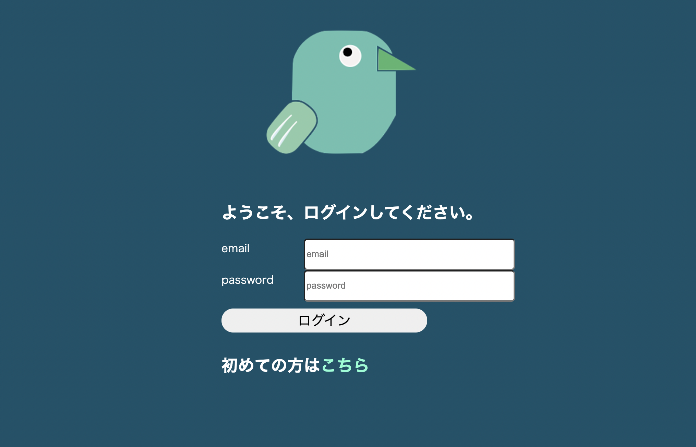
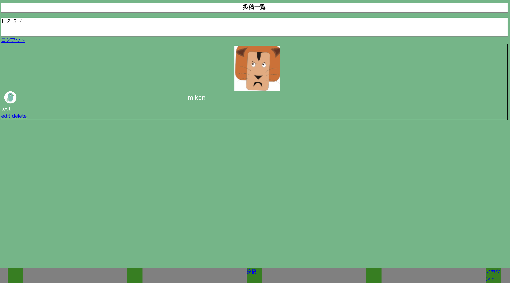

- チャット機能を再現
> 2021/7/1

# 実装したこと
- sessionとcookiesを使ったログイン機能

- ログインデータベースと投稿のデータベースを分けて実装

- 初めてイラストレータを使った

- データベースに画像を入れて表示する（最善の方法がわからない）

- 

- 

- 

# 頑張ったとこ
- 

- 

- 

# 気づき
- $dbn = 'mysql:dbname=MY_DB_NAME;charset=utf8;port=3306;host=localhost';
  $user = 'root';
  $pwd = '';
  ここは定数にまとめてconfig,phpファイルにまとめて他のページでも使えるようにしたら何度も書かなくていい
  でもどこまでを一緒にまとめるかが難しかった

- function h($str){
  return htmlspecialchars($str, ENT_QUOTES, 'utf-8');
  }って関数作っとくと便利

- if (!$email = filter_var($_POST['email'], FILTER_VALIDATE_EMAIL)) {
  echo '入力された値が不正っす';
  return false;
  }こういう書き方ってif文描きながら変数の$emailが作れるってこと？

- ini_set('display_errors', 1);
  画面にエラー出してくれる（便利かも）

- フォームから送信されたデータ確認でisset()は幅広く使える！

- prepareメソッドを利用して、SQL文を実行する場合はユーザからの入力を
  SQL文に含める事が出来ます。

-   $sql = "INSERT INTO abeeter_table(id, user_name, abeet, sex, password, email, post_time) 
  VALUES(NULL, :user_name, :abeet, $sex, :password, :email, sysdate())";

  $stmt = $pdo->prepare($sql);
  // 変数をバインド変数(:todo)に格納!!
  $stmt->bindValue(':user_name', $user_name, PDO::PARAM_STR);
  $stmt->bindValue(':abeet', $abeet, PDO::PARAM_STR);
  $stmt->bindValue(':password', $password, PDO::PARAM_STR);
  $stmt->bindValue(':email', $email, PDO::PARAM_STR);
  $status = $stmt->execute(); // SQLを実行

  文字列はバインド変数に格納してあげないとデータベースに入らない
  数値型は変数を使っても入った！（$sex）

- deleteはリンクタグ（a）よりcomfirmで確認画面をつけたいからjsで実装した方が良さそう

- 

# 工夫した点
- session_start();を使ってセッションidとクッキーで鍵を保存？
  したけどよくわからなかった
  ブラウザにキーを保存するのがCookiesでサーバーにキーを保存するのが
  session_id()っぽい

- phpファイルが多くなってきたのでフォルダに機能ごとにまとめた
- 
- 

# 修正するところ
- 同じ人が2人登録できる

- データベースの画像の表示